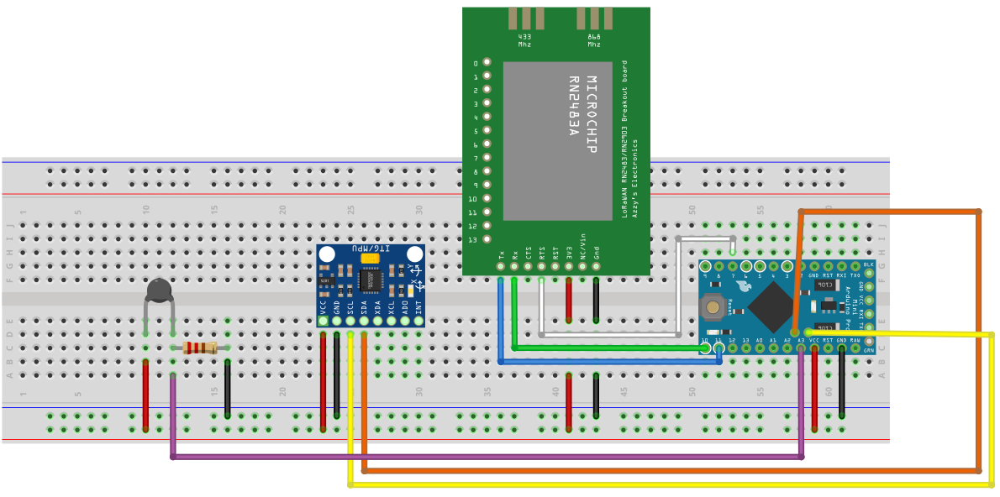
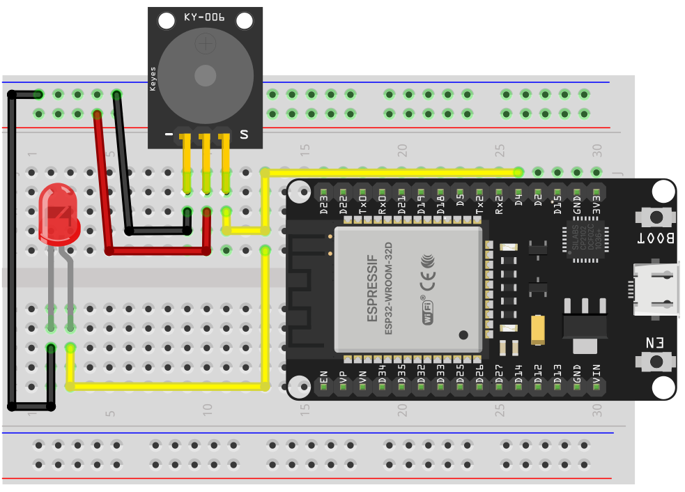

# Livestock Monitor Prototype

## Pin Connections

### RN2483 Module → Arduino Pro Mini

| RN2483 Pin    | Arduino Pin                    | Notes                                |
| ------------- | ------------------------------ | ------------------------------------ |
| **TX**        | **D10 (RX-in on Arduino)**     | LoRa → Arduino (serial data)         |
| **RX**        | **D11 (TX-out on Arduino)**    | Arduino → LoRa                       |
| **3V3**       | **VCC**                        | Powered by Arduino 3.3V rail         |
| **GND**       | **GND**                        | Common ground                        |
| **RST**       | **Not connected** or tied high | (Based on diagram: RST is not wired) |
| **CTS / RTS** | **Not connected**              | Hardware flow control unused         |

### Temperature Sensor → Arduino Pro Mini (Voltage Divider)

| Component / Pin       | Arduino Pin | Notes |
|-----------------------|-------------|-------|
| Sensor left pin       | VCC         | Sensor supply voltage |
| Sensor right pin      | → Resistor  | Forms voltage divider |
| Resistor (10K) left   | A0          | Analog input reads divider voltage |
| Resistor (10K) right  | GND         | Divider reference ground |

---

# ESP32 Alert System (Base station)

## Pin Connections

### Buzzer & LED → ESP32

| Component | Pin / Connection          | ESP32 Pin / Notes                     |
|-----------|----------------------------|----------------------------------------|
| **Buzzer** | S                          | D23 — Signal control                   |
|           | +                          | 3V3 — Power                            |
|           | –                          | GND — Ground                           |
| **LED**    | Anode (+)                  | D22 — LED control pin                  |
|           | Cathode (–) → Resistor 1k → | GND — Current-limiting resistor needed |

# File tree-structure of the Arduino Project Sketch.

TTN_Connect_V2/ 
│ 
├── TTN_Connect_V2.ino 
│ 
├── Accelerator.cpp 
├── Accelerator.h 
│ 
├── Config.h 
│ 
├── GPS.cpp 
├── GPS.h 
│ 
├── PNP_Management.cpp 
├── PNP_Management.h 
│ 
├── RN2483.cpp 
├── RN2483.h 
│ 
├── TTN_Config.h 
│ 
├── Utils.cpp 
└── Utils.h 

